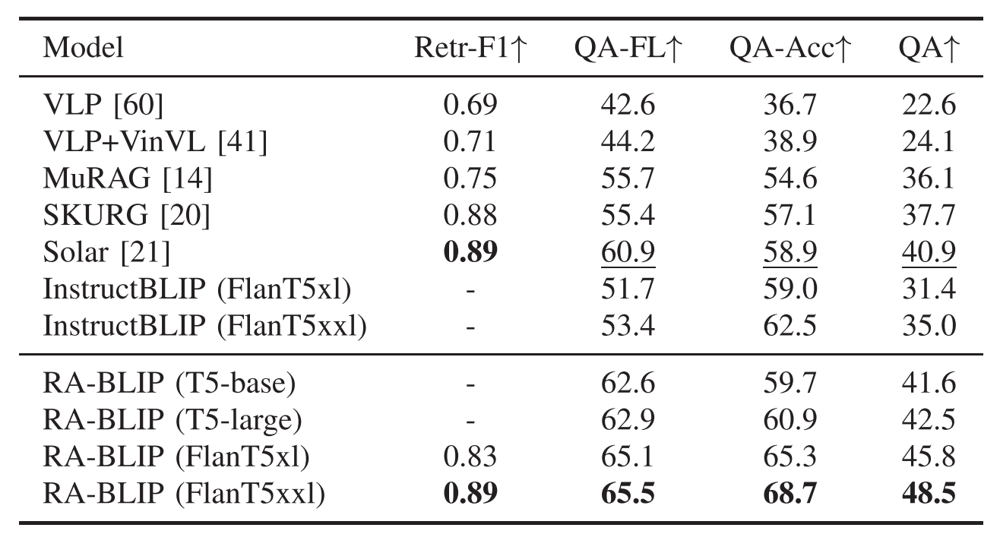

<div align="center">
<h2 align="center">
    <b>RA-BLIP: Multimodal Adaptive Retrieval-Augmented Bootstrapping Language-Image Pre-training </b>
</h2>
<div align="center">

<div>
Muhe Ding<sup>1</sup>,
Yang Ma<sup>2</sup>,
Pengda Qin<sup>3</sup>,
Jianlong Wu<sup>1&#9993</sup>,
Yuhong Li<sup>3</sup>,
Liqiang Nie<sup>1</sup>
</div>
<br>
<sup>1</sup>School of Computer Science and Technology, Harbin Institute of Technology, Shenzhen, China<br>
<sup>2</sup>School of Computer Science, University of Sydney, Sydney, Australia<br>
<sup>3</sup>Security Department, Alibaba Group, Hangzhou, China<br>
<br>
<sup>&#9993</sup>Corresponding authors
</div>
<div align="center">
    <a href="https://ieeexplore.ieee.org/iel8/6046/10844992/11125516.pdf" target="_blank">
    </a>
    <a href="#" target="_blank">
    </a>
    <a href="#" target="_blank">
    </a>
    <a href="#" target="_blank">
    </a>
</div>
</div>
        
## :rocket: Abstract 
Multimodal Large Language Models (MLLMs) have recently received substantial interest, which shows their emerging potential as general-purpose models for various vision-language tasks. MLLMs involve significant external knowledge within their parameters; however, it is challenging to continually update these models with the latest knowledge, which involves huge computational costs and poor interpretability. Retrieval augmentation techniques have proven to be effective plugins for both LLMs and MLLMs. 

In this study, we propose **multimodal adaptive Retrieval-Augmented Bootstrapping Language-Image Pre-training (RA-BLIP)**, a novel retrieval-augmented framework for various MLLMs. We first leverage the question to instruct the extraction of visual information through interactions with one set of learnable queries, minimizing irrelevant interference and redundancy during retrieval and generation. Besides, we introduce a pre-trained multimodal adaptive fusion module to achieve question text-to-multimodal retrieval and integration of multimodal knowledge by projecting visual and language modalities into a unified semantic space. Furthermore, we present an **Adaptive Selection Knowledge Generation (ASKG)** strategy to train the generator to autonomously discern the relevance of retrieved knowledge, which realizes excellent denoising performance. Extensive experiments on open multimodal question-answering datasets demonstrate that RA-BLIP achieves significant performance and surpasses the state-of-the-art retrieval-augmented models.

## 🧩 Framework

<p align="center">
  
</p>

**Overview of RA-BLIP:** 1. **Query-Instructed Visual Extraction:** We leverage the input question to guide the extraction of relevant visual features using learnable queries. This drastically reduces visual redundancy and irrelevant interference.
2. **Multimodal Adaptive Fusion:** A pre-trained fusion module projects both visual and textual modalities into a unified semantic space, enabling seamless text-to-multimodal retrieval.
3. **Adaptive Selection Knowledge Generation (ASKG):** The generator is trained to autonomously evaluate and filter retrieved knowledge, providing highly effective denoising before the final answer generation.

## ⚙️ Getting Started

### Installation
We recommend setting up the environment using `conda`:

```shell
# Create conda environment
conda create -n rablip python=3.9
conda activate rablip

# Install PyTorch
pip install torch torchvision torchaudio --index-url [https://download.pytorch.org/whl/cu118](https://download.pytorch.org/whl/cu118)

# Install required packages
git clone [https://github.com/YourOrg/RA-BLIP.git](https://github.com/YourOrg/RA-BLIP.git)
cd RA-BLIP
pip install -r requirements.txt


### Data Preparation

Download the pre-training datasets and downstream Multimodal QA datasets (e.g., OK-VQA, A-OKVQA). Organize them in the `./data` directory as follows:

```text
RA-BLIP/
├── data/
│   ├── pretrain/
│   ├── okvqa/
│   └── aokvqa/
```

### Checkpoints

Download the base MLLM weights and the pre-trained RA-BLIP retrieval/fusion modules from our [Huggingface repository](#) and place them in the `./checkpoints` folder.

---

## 🏃 Training & Evaluation

### Pre-training

To run the Bootstrapping Language-Image Pre-training with retrieval augmentation:

```bash
python run_pretrain.py \
    --config ./configs/pretrain.yaml \
    --output_dir ./output/pretrain
```

---

## 📊 Main Results

Extensive experiments demonstrate that RA-BLIP achieves state-of-the-art performance on open multimodal question-answering datasets, outperforming existing retrieval-augmented baseline models.

<p align="center">
  
</p>
<p align="center">
  <em>Table 1: Performance comparison of RA-BLIP against state-of-the-art retrieval-augmented models.</em>
</p>

---

## 🤗 Citation

If you find this work useful for your research, please kindly cite our TMM 2025 paper:

```bibtex
@article{rablip2025,
  title={RA-BLIP: Multimodal Adaptive Retrieval-Augmented Bootstrapping Language-Image Pre-training},
  author={Ding, Muhe and Ma, Yang and Qin, Pengda and Wu, Jianlong and Li, Yuhong and Nie, Liqiang},
  journal={IEEE Transactions on Multimedia (TMM)},
  year={2025},
  url={[https://ieeexplore.ieee.org/document/10844992](https://ieeexplore.ieee.org/document/10844992)}
}


