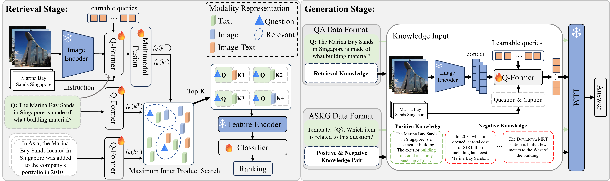
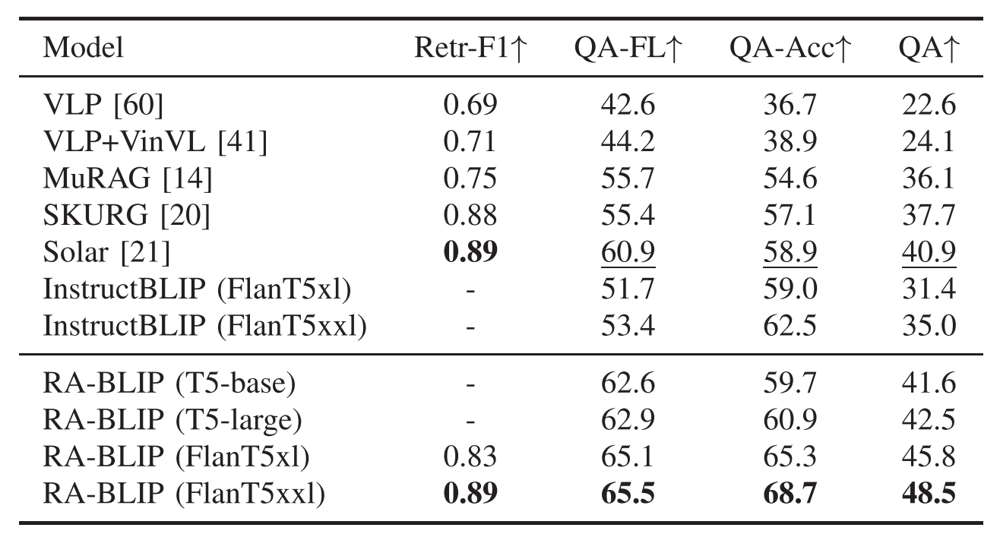

<div align="center">
<h2 align="center">
    <b>RA-BLIP: Multimodal Adaptive Retrieval-Augmented Bootstrapping Language-Image Pre-training</b>
</h2>

<div>
Muhe Ding<sup>1</sup>,
Yang Ma<sup>2</sup>,
Pengda Qin<sup>3</sup>,
Jianlong Wu<sup>1&#9993;</sup>,
Yuhong Li<sup>3</sup>,
Liqiang Nie<sup>1</sup>
</div>
<br>
<sup>1</sup>School of Computer Science and Technology, Harbin Institute of Technology, Shenzhen, China<br>
<sup>2</sup>School of Computer Science, University of Sydney, Sydney, Australia<br>
<sup>3</sup>Security Department, Alibaba Group, Hangzhou, China<br>
<br>
<sup>&#9993;</sup>Corresponding author
</div>

<div align="center">
    <a href="https://ieeexplore.ieee.org/iel8/6046/10844992/11125516.pdf" target="_blank">
    </a>
    <a href="https://huggingface.co/iLearn-Lab/TMM25-RA-BLIP/tree/main" target="_blank">
    </a>
</div>

## :bulb: Overview

Multimodal large language models store rich visual-language knowledge in their parameters, but updating that knowledge can be expensive and hard to interpret. RA-BLIP introduces a retrieval-augmented framework for multimodal question answering that learns to use retrieved visual and textual evidence while reducing irrelevant noise.

RA-BLIP contains three main components:

- **Query-Instructed Visual Extraction**: uses the question to guide visual feature extraction through learnable queries.
- **Multimodal Adaptive Fusion**: projects visual and textual evidence into a unified semantic space for question-to-multimodal retrieval.
- **Adaptive Selection Knowledge Generation (ASKG)**: trains the generator to select useful retrieved knowledge and suppress noisy evidence.



This code release focuses on the WebQA training and evaluation pipeline.

## :open_file_folder: Data and Checkpoints

Prepare the WebQA annotations and image features before training or evaluation. Please download and prepare the WebQA data following the official WebQA repository:

- [WebQA: Multihop and Multimodal QA](https://github.com/WebQnA/WebQA)

After preparing the WebQA files, organize them as follows:

```text
RA-BLIP/
├── webqa_dataset/
│   ├── WebQA_train_val.json
│   ├── webqa_test_retrieval_89.json
│   ├── imgs.tsv
│   └── imgs.lineidx
└── checkpoints/
    └── <ra_blip_checkpoint>.pth
```

Download the released RA-BLIP weights from Hugging Face:

- [iLearn-Lab/TMM25-RA-BLIP](https://huggingface.co/iLearn-Lab/TMM25-RA-BLIP/tree/main)

## :gear: Installation

```bash
conda create -n rablip python=3.9
conda activate rablip

pip install torch torchvision torchaudio --index-url https://download.pytorch.org/whl/cu118
pip install -r requirements.txt
```

## :computer: Training on WebQA

Update the WebQA data paths and output directory in `train_webqa.sh` if needed, then run:

```bash
bash train_webqa.sh
```

## :mag: Evaluation on WebQA

Update the WebQA data paths and checkpoint name in `eval_webqa.sh` if needed, then run:

```bash
bash eval_webqa.sh
```

## :bar_chart: Results

The paper reports RA-BLIP results on WebQA and compares with retrieval-augmented multimodal QA baselines.



## :hugs: Citation

If you find this repository useful, please cite:

```bibtex
@article{ding2025rablip,
  title={RA-BLIP: Multimodal Adaptive Retrieval-Augmented Bootstrapping Language-Image Pre-training},
  author={Ding, Muhe and Ma, Yang and Qin, Pengda and Wu, Jianlong and Li, Yuhong and Nie, Liqiang},
  journal={IEEE Transactions on Multimedia},
  year={2025}
}
```

## :pray: Acknowledgement

This work builds on the following codebases. Thanks to their great work.

- [WebQA](https://github.com/WebQnA/WebQA), for the WebQA benchmark and data format.
- [InstructBLIP](https://github.com/salesforce/LAVIS/tree/main/projects/instructblip), for the InstructBLIP/LAVIS implementation.

## References

- WebQA: Multihop and Multimodal QA. CVPR 2022.
- InstructBLIP: Towards General-purpose Vision-Language Models with Instruction Tuning. NeurIPS 2023.
